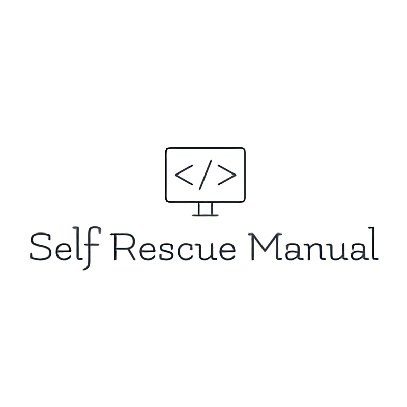
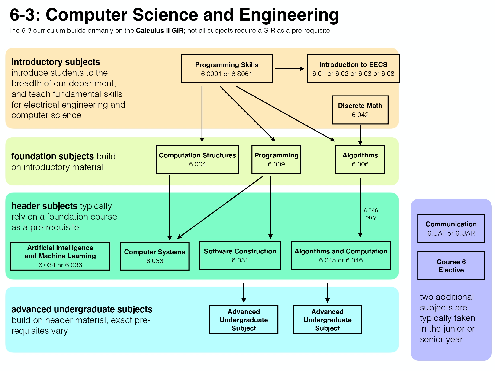

<!-- PROJECT SHIELDS -->
[![Contributors][contributors-shield]][contributors-url]
[![MIT License][license-shield]][license-url]
[![Forks][forks-shield]][forks-url]
[![Stargazers][stars-shield]][stars-url]
[![Issues][issues-shield]][issues-url]

<!-- PROJECT LOGO -->
 

  

<h3 align="center">CS Self-Rescue Manual</h3>

  

    A Self-Rescue Manual for people who want to teach themselves Computer Science systematically.
  

<!-- TABLE OF CONTENTS -->

  
Table of Contents

  <ol>
    <li>
      <a href="#introduction">Introduction</a>
    </li>
    <li>
      <a href="#getting-started">Getting Started</a>
      <ul>
        <li><a href="#preparation">Preparation</a></li>
        <li><a href="#online-resources">Online Resources</a></li>
        <li><a href="#roadmap">Road Map</a></li>
      </ul>
    </li>
    <li>
      <a href="#maths">Maths</a>
      <ul>
        <li><a href="#discrete-maths">Discrete Mathematics</a></li>
        <li><a href="#information-theory">Information Theory</a></li>
        <li><a href="#analysis">Analysis</a></li>
        <li><a href="#linear-algebra">Linear Algebra</a></li>
        <li><a href="#statistics">Statistics</a></li>
        <li><a href="#advanced-maths">Advanced Topics</a></li>
      </ul>
    </li>
    <li>
      <a href="#nature-science">Nature Science</a>
      <ul>
        <li><a href="#physics">Physics</a></li>
        <li><a href="#chemistry">Chemistry</a></li>
        <li><a href="#biology">Biology</a></li>
      </ul>
    </li>
    <li>
      <a href="#introductory-subjects">Introductory Subjects</a>
      <ul>
        <li><a href="#introduction-to-eecs">Introductory Course</a></li>
        <li><a href="#cs-tools">CS Tools</a></li>
        <li><a href="#basic-programming">Basic Programming Skills</a></li>
      </ul>
    </li>
    <li>
      <a href="#fundation-subjects">Fundation Subjects</a>
      <ul>
        <li><a href="#advanced-programming">Advanced Programming</a></li>
        <li><a href="#algorithms">Algorithms</a></li>
        <li><a href="#digital-systems">Digital Systems</a></li>
      </ul>
    </li>
    <li>
      <a href="#header-subjects">Header Subjects</a>
      <ul>
        <li><a href="#software-construction">Software Construction</a></li>
        <li><a href="#computer-systems">Computer Systems</a></li>
        <li><a href="#advanced-algorithms">Advanced Algorithms</a></li>
        <li><a href="#machine-learning">Machine Learning</a></li>
      </ul>
    </li>
    <li>
      <a href="#advance-subjects">Advanced Subjects</a>
      <ul>
        <li><a href="#Operating-systems">Operating Systems</a></li>
        <li><a href="#distributed-systems">Distributed Systems</a></li>
        <li><a href="#computer-network">Computer Network</a></li>
        <li><a href="#database">Database</a></li>
        <li><a href="#compilers">Compilers</a></li>
        <li><a href="#computer-security">Computer Security</a></li>
        <li><a href="#deep-learning">Deep Learning</a></li>
        <li><a href="#advanced-machine-learning">Advanced Machine Learning</a></li>
      </ul>
    </li>
    <li><a href="#license">License</a></li>
    <li><a href="#contributing">Contributing</a></li>
    <li><a href="#contact">Contact</a></li>
    <li><a href="#acknowledgments">Acknowledgments</a></li>
  </ol>

<!-- ABOUT THE PROJECT -->

## Introduction
Firstly,some self-introduction: I am currently(2021) an undergraduate student at SJTU,China. Personally, I am very disappointed in the curriculum as well as the teaching in my department. Due to my passion toward computer science, I've decided to learn computer science all by myself, hence the title **CS-Self-Rescue-Manual**. A lot of renowned universities have shared numerous courses online and I've put them togethem for a complete learning program. Hope you Enjoy! 

(<a href="#top">back to top</a>)

<!-- GETTING STARTED -->

## Getting Started

### Preparation

Before getting into any details about CS learning, I first want to share my two cents on learning itself.
- **When learning, always be aware of what your goal is**, and then selet resources and make study plan accordingly. Reading this manual, you may have various purposes ranging from desiring to conquer a problem during work while lacking knowledge on certain fields to simply wanting to improve your GPA. If you just want a better score, I suggest you put most of your time on class materials from your teacher and try to get exam problems from past years. However, if you care more about learning computer science systematically from the best professors, I suggest you go through this manual carefully and choose courses you want to learn from every topic.
- **Dive directly, Start immediately.** Translation: If you want to learn something, dive directly in that topic and then come back for things you don't understand;Start the learning process fast, change plan afterwards. This maybe somewhat adventurous and agressive, but it's the way to learn most efficiently.

(<a href="#top">back to top</a>)

### Online Resources

There are already many projects about learning CS by yourself online, so first I am going to list some of the best projects that I've taken reference. Thank you for the inspiration.
- [MIT Challenge by Scott H. Young](https://www.scotthyoung.com/blog/myprojects/mit-challenge-2/)
 
  This is the first project that I've come across while searching for resources. The arthor finished all MIT CS undergraduate courses in merely one year. Definitely make sure you check out his learning experience and his mindset while learning, which I find most helpful.

  He's also written several books about learning and I've taken several advice from his book [Ultralearning](https://www.scotthyoung.com/blog/ultralearning/). You can also check [my note on Ultralearning](Other%20Resources/Ultralearning%20Notes.pdf). 

- [Teach Yourself CS](https://teachyourselfcs.com) (A very detailed and structured guide.)
- [CS-Self-Learning](https://csdiy.wiki) (Written by a PKU undergraduate, very comprehensive.)

Then I am going to list some common websites to find online courses you need. Props to all the universites and organiztion for sharing the knowledge online!
- [Libgen](https://libgen.rs)
  (The website to find ALL e-books.)
- [MIT OpenCourseWare](https://ocw.mit.edu/index.html)
  (Include almost every course in MIT. However, video lectures aren't available in every course.)
- [MIT Open Library](https://openlearning.mit.edu/courses-programs/open-learning-library)
  (Selected courses from MIT OCW, reconstructed for better online learning)
- [Stanford Engineering Everywhere](https://see.stanford.edu/Course)
  (Stanford online learning program, however there is only a few courses.)
- [Coursera](https://coursera.org)
  (Popular online learning website. However a lot of courses are much easier than actually taught in class)
- [Edx](https://edx.org)
  (Similar to coursera. Most courses are from MIT and Harvard)

A lot of other great courses are hosted on an individual website. You can first get the course number from the following websites and then search for course material on [Google](https://www.google.com), [Youtube](https://www.youtube.com) or [Bilibili](https://bilibili.com).
- [MIT Course List](http://student.mit.edu/catalog/m6a.html)
- [UC Berkely Course List](https://www2.eecs.berkeley.edu/Courses/CS/?_ga=2.49145060.370293363.1598336094-476512950.1598336094)
- [CMU Course List](https://csd.cmu.edu/cs-and-related-undergraduate-courses)
- [Stanford Course List](https://www.classcentral.com/report/stanford-on-campus-courses/) (Paired with links to course pages)

(<a href="#top">back to top</a>)

<!-- ROADMAP -->

### Roadmap

After having access to all the online resources, you still need to make a more detailed plan to study systematically as some of the courses have dependencies. Gladly, a lot of the universities have again shared their CS program roadmap. The picture below is the roadmap from MIT:
 

  

Here are more roadmaps from other universities:
- [UC Berkely Roadmap](https://hkn.eecs.berkeley.edu/courseguides) (Interactive website!)
- [CMU Roadmap](http://coursecatalog.web.cmu.edu/schools-colleges/schoolofcomputerscience/undergraduatecomputerscience/#bscurriculumtextcontainer) 
- [MIT Roadmap](http://catalog.mit.edu/degree-charts/computer-science-engineering-course-6-3/) (Of another format.)

Since [MIT OpenCourseWare](https://ocw.mit.edu/index.html) has the most courses paired with video lectures, this manual will mostly follow its roadmap, and then paired with other courses for supplement.

With all the resources mentioned above, I can safely say that you can make your own learning program now customized for your goal. Feel free to fork this repo and make your own roadmap, and don't forget to leave this project a star :star_struck: .

(<a href="#top">back to top</a>)

<!-- Maths -->
## Maths
### Intro
Calculus, matrix manipulation and probability are mandated. However, I believe some exposure to rigorous math is helpful for future learning, therefore some books about analysis and advanced algebra will also be recommended. After that, you can select topics based on your interest and time.

### Discrete Maths

1. UCB-CS70-Discrete Math and Probability theory

    - [Video Lecture(Spring 2015)](https://www.youtube.com/watch?v=LaKt90H4p6Q&list=PLzAv_uHZw7dTI2e0F8-lxxOWV9zXMzwNE)

    - [Course Resources](https://github.com/PKUFlyingPig/UCB-CS70)

2. MIT-6.042J-Mathematics for Computer Science

    - [MIT OCW Course Page](https://ocw.mit.edu/courses/electrical-engineering-and-computer-science/6-042j-mathematics-for-computer-science-fall-2010/index.htm)

    - [MIT Open Library Page](https://openlearninglibrary.mit.edu/courses/course-v1:OCW+6.042J+2T2019/course/)
### Information Theory

1. MIT-6.050J-Information and Entropy

    - [MIT OCW Course Page](https://ocw.mit.edu/courses/electrical-engineering-and-computer-science/6-050j-information-and-entropy-spring-2008/index.htm)

    - [MIT Textbook](https://ocw.mit.edu/courses/electrical-engineering-and-computer-science/6-050j-information-and-entropy-spring-2008/syllabus/MIT6_050JS08_textbook.pdf)

2. Cambridge-The Information Theory, Patter Recognition, and Neural Networks

    - [Video Lectures](https://www.youtube.com/watch?v=BCiZc0n6COY&list=PLruBu5BI5n4aFpG32iMbdWoRVAA-Vcso6)
   
    - [Slides](http://www.inference.org.uk/mackay/itprnn/Slides.shtml)
   
    - [Book](http://www.inference.org.uk/mackay/itila/)

### Analysis

1. MIT-18.01&18.02-Calculus
    
    - [MIT Open Library Page](https://openlearninglibrary.mit.edu/courses/course-v1:MITx+18.01.1x+2T2019/course/)
    
2. Understanding Analysis-Stephen Abbott (Book)

3. Analysis-Terence Tao (Book)
    
### Linear Algebra

1. MIT-18.06

    - [MIT Open Library Page](https://openlearninglibrary.mit.edu/courses/course-v1:OCW+18.06SC+2T2019/course/)

2. Linear Algebra Done Right-Sheldon Axler (Book)

    - [Arthor's Explanation](https://www.bilibili.com/video/av17050168/?p=1)
    
    - [Problemset Solution](https://linearalgebras.com/)
    
3. [3Blue1Brown Youtube Channel](https://www.youtube.com/c/3blue1brown)

### Statistics

1. MIT-6.041-Probabilistic Systems Analysis and Applied Probability
    
    - [MIT OCW Page](https://ocw.mit.edu/courses/electrical-engineering-and-computer-science/6-041sc-probabilistic-systems-analysis-and-applied-probability-fall-2013/index.htm)
    
    - [Video Lecture](https://www.youtube.com/watch?v=j9WZyLZCBzs&list=PLUl4u3cNGP61MdtwGTqZA0MreSaDybji8)

2. MIT-18.650-Statistics for Application

    - [MIT OCW Page](https://ocw.mit.edu/courses/mathematics/18-650-statistics-for-applications-fall-2016/index.htm)

3. UCB-CS 126-Probability Theory(Advanced)
   
    - [Textbook](https://link.springer.com/content/pdf/10.1007%2F978-3-030-49995-2.pdf)
    
    - [Jupyter Notebook](https://jeanwalrand.github.io/PeecsJB/intro.html)

    - [Course Resources](https://inst.eecs.berkeley.edu/~ee126/fa20/content.html)

4. MIT-6.262-Discrete Stochastic Processes

    - [MIT OCW Course Page](https://ocw.mit.edu/courses/electrical-engineering-and-computer-science/6-262-discrete-stochastic-processes-spring-2011/index.htm)

### Advanced maths

1. Stanford-EE 364A/B-Convex Optimization

    - [364A Course Page](https://see.stanford.edu/Course/EE364A)

    - [364B Course Page](https://see.stanford.edu/Course/EE364B)
    
    - [Newer Version of 364A Video Lecture](https://www.youtube.com/watch?v=VNON98dKjno&list=PLoCMsyE1cvdXeoqd1hGaMBsCAQQ6otUtO)

2. MIT-18.03-Differential Equations

    - [MIT OCW Page](https://ocw.mit.edu/courses/mathematics/18-03sc-differential-equations-fall-2011/)
    
    - [Video Lectures](https://www.youtube.com/watch?v=76WdBlGpxVw&list=PL64BDFBDA2AF24F7E)

3. MIT-18.330-Introduction to numerical analysis

    - [Video Lectures](https://www.dropbox.com/sh/ubkqwrqxnukgllc/AAA2cH9r7YQL7WmYVt-bblxta?dl=0)
    
    - [Problem Sets](https://github.com/PKUFlyingPig/MIT18.330)
    
    - [MIT OCW Page](https://ocw.mit.edu/courses/mathematics/18-330-introduction-to-numerical-analysis-spring-2012/)
    
4. CMU-10-801-Advanced Optimization and Randomized Methods

    - [Course Page](http://www.cs.cmu.edu/~suvrit/teach/aopt.html)

(<a href="#top">back to top</a>)

<!-- Natrue Science -->
## Nature Science
### Intro
In the MIT Program, two physics courses, one chemistry course and one biology course are mandated. It's true that interdisciplinary fields are becoming more and more popular and promising, I hold the view that an introductory level of knowledge on nature science is enough for a student aimed at Computer Science. In the future, if you are interested in a particular field, just learn it by then. You can't learn everything, PRIORITIZE your time!

Therefore, I will only list some introductory course below.

### Physics
- [MIT 8.01 Mechanics](https://openlearninglibrary.mit.edu/courses/course-v1:MITx+8.01.1x+3T2018/about)

- [MIT 8.02 Electricity and Magnetism](https://openlearninglibrary.mit.edu/courses/course-v1:MITx+8.02.1x+1T2019/about)

- [MIT 8.03 Vibrations and Waves](https://openlearninglibrary.mit.edu/courses/course-v1:MITx+8.03x+1T2020/about)

- [MIT 8.370 Quantum Information](https://openlearninglibrary.mit.edu/courses/course-v1:MITx+8.370.1x+1T2018/about)

### Chemistry
- [MIT 5.111 Principles of Chemical Science](https://ocw.mit.edu/courses/chemistry/5-111sc-principles-of-chemical-science-fall-2014/index.htm)

### Biology
- [MIT 7.016 Introductory Biology](https://ocw.mit.edu/courses/biology/7-016-introductory-biology-fall-2018/index.htm)

(<a href="#top">back to top</a>)

<!-- Introductory Subjects -->
## Introductory Subjects

### Introduction to EECS

- [MIT-6.01-Introduction to EE/CS vis Robotics](https://ocw.mit.edu/courses/electrical-engineering-and-computer-science/6-01sc-introduction-to-electrical-engineering-and-computer-science-i-spring-2011/index.htm)

- [MIT-6.02-Introduction to EE/CS via Communication Networks](https://ocw.mit.edu/courses/electrical-engineering-and-computer-science/6-02-introduction-to-eecs-ii-digital-communication-systems-fall-2012/index.htm)

### CS Tools

- MIT-Missing Semester

    - [2020 Web Page](https://missing.csail.mit.edu/2020/)
    
    - [2020 Video Lectures](https://www.youtube.com/playlist?list=PLyzOVJj3bHQuloKGG59rS43e29ro7I57J)

### Basic Programming

1. MIT-6.0001-Introduction to Computer Science and Programming in Python

    - [MIT OCW Page](https://ocw.mit.edu/courses/electrical-engineering-and-computer-science/6-0001-introduction-to-computer-science-and-programming-in-python-fall-2016/)

2. Stanford-CS 106A-Programming Methodology

    - [Stanford Engineering Everywhere Page](https://see.stanford.edu/Course/CS106A)
    
    - [Spring 2017 Web Page](http://web.stanford.edu/class/archive/cs/cs106a/cs106a.1176/lectures.shtml)
    
    - [Spring 2017 Video Lectures](https://www.youtube.com/watch?v=k6u4EhJh5oo&list=PL-h0BZdG_K4myglyF0owcVh9a0oO_arhD&index=1)
    
3. Stanford-CS 106L-Standard C++ Programming

    - [Course Web Page](http://web.stanford.edu/class/cs106l/)
    
    - [Fall 2020 Video Lectures](https://www.youtube.com/watch?v=Ct3QF2qENGM&list=PLCgD3ws8aVdolCexlz8f3U-RROA0s5jWA)
    
    - [Assignment Reference](https://github.com/PKUFlyingPig/CS106L)
    
4. UCB-CS 61A-Structure and Interpretation of Computer Programs

    - [Summer 2019 Web Page](https://inst.eecs.berkeley.edu/~cs61a/su19/)
    
    - [Summer 2019 Video Lectures](https://www.youtube.com/watch?v=vYynOGcDW-8&list=PLXN9vwbk5m7buBvROwNxM6H4zGe7w5hjb)
    
    - [Summer 2020 Web Page](https://inst.eecs.berkeley.edu/~cs61a/su20/)
    
    - [Assignment Reference](https://github.com/PKUFlyingPig/CS61A)
    

(<a href="#top">back to top</a>)

<!-- Fundation Subjects -->
## Fundation Subjects

### Advanced programming

1. MIT-6.009-Fundamentals of Programming

    - [Spring 2019 Lab](https://github.com/griffin-leonard/6.009-labs)

2. Stanford-CS 106B-Programming Abstractions

    - [Stanford Engineering Everywhere Page](https://see.stanford.edu/Course/CS106B)

    - [Winter 2018 Web Page](http://web.stanford.edu/class/archive/cs/cs106b/cs106b.1184/lectures.shtml)
    
    - [Winter 2018 Video Lectures](https://www.youtube.com/watch?v=L6lvEkCj7Us&list=PL-h0BZdG_K4mfItKR5nUChmnuus-q-Tbc)
    
    - [Spring 2015 Web Page](http://stanford.edu/class/archive/cs/cs106b/cs106b.1156/lectures.shtml)
    
    - [Spring 2015 Video Lectures](https://www.youtube.com/watch?v=FIroM06V2MA&list=PL-h0BZdG_K4kAmsfvAik-Za826pNbQd0d&index=1)

3. Stanford-CS 107-Programming Paradigms

    - [Stanford Engineering Everywhere Page](https://see.stanford.edu/Course/CS107)

4. Stanford-CS 110L-Safety in Systems Programming (Rust Programming Language)

    - [Spring 2020 Web Page](https://reberhardt.com/cs110l/spring-2020/)
    
    - [Assignment Reference](https://github.com/PKUFlyingPig/CS110L)

### Algorithms

1. MIT-6.006-Introduction to Algorithms

    - [Spring 2020 Web Page](https://ocw.mit.edu/courses/electrical-engineering-and-computer-science/6-006-introduction-to-algorithms-spring-2020/)
    
2. UCB-CS 61B-Data Structures

    - [Spring 2018 Web Page](https://sp18.datastructur.es/)
    
    - [Assignment Reference](https://github.com/PKUFlyingPig/CS61Bj)

3. Princeton-Algorithm 1&2

    - [Algorithm 1 Coursera Page](https://www.coursera.org/learn/algorithms-part1)

    - [Algorithm 2 Coursera Page](https://www.coursera.org/learn/algorithms-part2)
    
    - [Arthor's Repository](https://algs4.cs.princeton.edu/code/)
    
    - [Assignment Reference](https://github.com/PKUFlyingPig/Princeton-Algorithm)

### Digital Systems

1. MIT-6.004-Computation Structures

    - [MIT OCW Page (Spring 2017) ](https://ocw.mit.edu/courses/electrical-engineering-and-computer-science/6-004-computation-structures-spring-2017/index.htm)
    
    - [Spring 2016 Video Lectures](https://www.youtube.com/watch?v=9DWlqtsNGV0&list=PLXQjwcK5b0J4bUrLkGaNRS22hUrfUjMJd&index=1)
    
    - [Fall 2018 Video Lectures](https://www.youtube.com/watch?v=7P-LGEJS3A8&list=PLDSlqjcPpoL64CJdF0Qee5oWqGS6we_Yu&index=2)

2. MIT-6.007-Signals and Systems

    - [MIT OCW Page](https://ocw.mit.edu/resources/res-6-007-signals-and-systems-spring-2011/index.htm)

3. UCB-EE 16A&B-Designing Information Devices and Systems
    
    - [16A Spring 2017 Web Page](https://inst.eecs.berkeley.edu/~ee16a/sp17/)
    
    - [16A Spring 2017 Video Lectures](https://www.youtube.com/watch?v=UxCNT4d_Mys&list=PLkFD6_40KJIwZ9gavHhd0QPxn7NzmOexA&index=1)
    
    - [16B Fall 2015 Web Page](https://inst.eecs.berkeley.edu/~ee16b/fa15/)

    - [16B Fall 2015 Video Lectures](https://www.bilibili.com/video/av883401324?from=search&seid=10401919049963663965&spm_id_from=333.337.0.0)

4. UCB-EE 120-Signals and Systems

    - [Fall 2019 Web Page](https://inst.eecs.berkeley.edu/~ee120/fa19/)
    
    - [Fall 2022 Lab](https://github.com/dominiccarrano/ee-120-labs)
    
    - [Assignment Reference](https://github.com/PKUFlyingPig/UCB-EE120)

(<a href="#top">back to top</a>)

<!-- Header Subjects -->
## Header Subjects

### Software Construction

1. MIT-6.031-Software Construction

    - [Spring 2021 Web Page](http://web.mit.edu/6.031/www/sp21/)
    
    - [Assignment Reference](https://github.com/PKUFlyingPig/MIT6.031-software-construction)

2. MIT-6.073-Creating Video Games

    - [MIT OCW Course Page](https://ocw.mit.edu/courses/comparative-media-studies-writing/cms-611j-creating-video-games-fall-2014/index.htm)
    
    - [Video Lectures](https://ocw.mit.edu/courses/comparative-media-studies-writing/cms-611j-creating-video-games-fall-2014/lecture-videos/)
    
3. UCB-CS 169-Software Engineering

    - [Edx Course Page](https://www.edx.org/professional-certificate/berkeleyx-mastering-agile-development-of-software-as-a-service?index=product&queryID=0c4c743bba0620dced2ccd02545e94d5&position=1)
    
    - [Fall 2019 Video Lectures](https://www.bilibili.com/video/av77275569?from=search&seid=11604182904046718417&spm_id_from=333.337.0.0)
    
    - [Textbook Videos](http://www.saasbook.info/videos)
    
    - [Textbook](https://github.com/PKUFlyingPig/CS169-Software-Engineering/blob/master/saasbook.pdf)

4. Harvard-CS 164-Mobile Software Engineering
   
    - [Video Lectures](https://www.youtube.com/c/CS164)

5. Harvard-CS 75-Building Dynamic Web Pages

    - [Video Lectures](https://www.youtube.com/user/cscie75)

### Computer Systems

1. MIT-6.033-Computer Systems (Contain all aspects, include OS,Network,Security...)

    - [MIT OCW Page](https://ocw.mit.edu/courses/electrical-engineering-and-computer-science/6-033-computer-system-engineering-spring-2018/index.htm)

    - [Spring 2021 Web Page](https://web.mit.edu/6.033/2021/wwwdocs/)
    
    - [Spring 2021 Video Lectures](https://www.bilibili.com/video/av933819380?from=search&seid=14757730192638677011&spm_id_from=333.337.0.0)
    
    - [Hand Ons](http://web.mit.edu/6.033/2019/wwwdocs/handsons.shtml)

2. MIT-6.823-Computer System Architecture (Without Videos)

    - [MIT OCW Page](https://ocw.mit.edu/courses/electrical-engineering-and-computer-science/6-823-computer-system-architecture-fall-2005/index.htm)
    
    - [Fall 2021 Web Page](http://csg.csail.mit.edu/6.823/index.html)

3. UCB-CS 61C-Great Ideas in Computer Architecture

    - [Summer 2020 Web Page](https://inst.eecs.berkeley.edu/~cs61c/su20/)

    - [Summer 2020 Video Lectures](https://www.youtube.com/playlist?list=PLDoI-XvXO0aqgoMQvogzmf7CKiSMSUS3M)
    
    - [Assignment Reference](https://github.com/PKUFlyingPig/CS61C-summer20)

4. CMU-15-213-CSAPP

    - [Fall 2015 Web Page](https://www.cs.cmu.edu/afs/cs/academic/class/15213-f15/www/schedule.html)
    
    - [Fall 2015 Video Lectures](https://www.youtube.com/watch?v=ScMxnXq6fbI&list=PLcQU3vbfgCc9sVAiHf5761UUApjZ3ZD3x)
    
    - [CSAPP Lab Assignment](http://csapp.cs.cmu.edu/3e/labs.html)
    
    - [Lab Reference](https://github.com/Exely/CSAPP-Labs)

5. Nand2Tetris

    - [Coursera Part 1](https://www.coursera.org/learn/build-a-computer)

    - [Coursera Part 2](https://www.coursera.org/learn/nand2tetris2)

    - [Official Website](https://www.nand2tetris.org/)
    
    - [Lab Reference](https://github.com/woai3c/nand2tetris)

### Advanced Algorithms

1. MIT-6.046-Design and Analysis of Algorithms

    - [MIT OCW Page](https://ocw.mit.edu/courses/electrical-engineering-and-computer-science/6-046j-design-and-analysis-of-algorithms-spring-2015/index.htm)
    
    - [Video Lectures](https://ocw.mit.edu/courses/electrical-engineering-and-computer-science/6-046j-design-and-analysis-of-algorithms-spring-2015/lecture-videos/)

2. MIT-6.045-Automata, Computability, and Complexity

    - [MIT OCW Page](https://ocw.mit.edu/courses/electrical-engineering-and-computer-science/6-045j-automata-computability-and-complexity-spring-2011/index.htm)
    
    - [Spring 2015 Video Lectures](https://www.youtube.com/watch?v=vhTlazaGAF8&list=PLmUkKyGlHupqtANK5Pmo1gjLlmW1pF1q7&index=1&t=2056s)
    
    - [Spring 2020 Web Page](https://people.csail.mit.edu/rrw/6.045-2020/)

3. UCB-CS 170-Efficient Algorithms and Intractable Problems

    - [Spring 2020 Web Page](https://inst.eecs.berkeley.edu/~cs170/sp20/)
    
    - [Spring 2020 Video Lectures](https://www.bilibili.com/video/BV1BU4y1b7RK?from=search&seid=6706826427481222237&spm_id_from=333.337.0.0)
    
    - [Assignment Reference](https://github.com/PKUFlyingPig/UCB-CS170)

### Machine Learning

1. CMU-10-606-Maths Background for ML

    - [Video Lectures](https://www.youtube.com/playlist?list=PL7y-1rk2cCsAqRtWoZ95z-GMcecVG5mzA)

    - [Course Slides and Notes](https://github.com/geoffgordon/2022-sp-10-606-607)

2. MIT-6.036-Introduction to Machine Learning
   
    - [MIT Open Library Page](https://openlearninglibrary.mit.edu/courses/course-v1:MITx+6.036+1T2019/course/)

3. MIT-6.034-Artificial Intelligence

    - [MIT OCW Page](https://ocw.mit.edu/courses/electrical-engineering-and-computer-science/6-034-artificial-intelligence-fall-2010/index.htm)
    
4. Harvard-CS50’s Introduction to Artificial Intelligence with Python

    - [Course Web Page](https://cs50.harvard.edu/ai/2020/)
    
    - [Assignment Reference](https://github.com/PKUFlyingPig/cs50_ai)

5. UCB-CS 188-Introduction to Artificial Intelligence

    - [Fall 2018 Page](https://inst.eecs.berkeley.edu/~cs188/fa18/index.html)
    
6. UCB-CS 189-Machine Learning

    - [Fall 2019 Video Lectures](https://www.youtube.com/watch?v=slGymxkELYE&list=PLOOm2AoWIPEyZazQVnIcaK2KnezpGZV-X)
    
    - [Spring 2021 Web Page](https://people.eecs.berkeley.edu/~jrs/189/)

7. Stanford-CS 229-Machine Learning

    - [Autumn 2018 Page](http://cs229.stanford.edu/syllabus-autumn2018.html) 
    
    - [Autumn 2018 Video Lectures(Andrew NG)](https://www.youtube.com/watch?v=jGwO_UgTS7I&list=PLoROMvodv4rMiGQp3WXShtMGgzqpfVfbU)
    
    - [Summer 2020 Page](http://cs229.stanford.edu/syllabus-summer2020.html)
    
    - [Summer 2020 Video Lectures](https://www.youtube.com/watch?v=KzH1ovd4Ots&list=PLoROMvodv4rNH7qL6-efu_q2_bPuy0adh)

(<a href="#top">back to top</a>)

<!-- Advanced Subjects -->
## Advanced Subjects
### Operating System

1. MIT-6.S081-Operating System

    - [Fall 2020 Page](https://pdos.csail.mit.edu/6.S081/2020/schedule.html)
    
    - [Fall 2020 Video Lectures](https://www.bilibili.com/video/BV19k4y1C7kA?p=1)
    
    - [Textbook](https://pdos.csail.mit.edu/6.828/2021/xv6/book-riscv-rev2.pdf)
    
    - [Assignment Reference-1](https://github.com/KuangjuX/xv6-riscv-solution)

    - [Assignment Reference-2](https://github.com/PKUFlyingPig/MIT6.S081-2020fall)

2. UCB-CS 162-Operating System

    - [Fall 2021 Page](https://inst.eecs.berkeley.edu/~cs162/fa21/)
    
    - [Textbook](http://ospp.cs.washington.edu/)

### Distributed Systems

1. MIT-6.824-Distributed Systems

    - [Spring 2020 Video Lectures](https://www.youtube.com/watch?v=cQP8WApzIQQ&list=PLrw6a1wE39_tb2fErI4-WkMbsvGQk9_UB)
    
    - [Spring 2020 Page](http://nil.lcs.mit.edu/6.824/2020/schedule.html)
    
    - [Assignment Reference](https://github.com/chaozh/MIT-6.824)

### High performance Computing

1. CMU-15-418-Parallel Computing

    - [Spring 2016 Page](http://15418.courses.cs.cmu.edu/spring2016/)
    
    - [Spring 2016 Video Lectures](https://www.bilibili.com/video/BV16k4y1z7z9?p=1)
    
    - [Assignment Reference](https://github.com/PKUFlyingPig/CS149-parallel-computing)

### Computer Network

### Database

### Compilers

### Computer Security

### Computer Graphics

### Deep Learning

### Advanced Machine Learning

<!-- License -->

## License

This project is under the MIT license. However, the online resources mentioned above are licensed under whatever license the arthor uses.
If you believe there are copyright issues, please contact with me.

(<a href="#top">back to top</a>)

<!-- CONTRIBUTING -->

## Contributing

Contributions are what make the open source community such an amazing place to learn, inspire, and create. Any contributions you make are **greatly appreciated**.

If you have a suggestion that would make this better, please fork the repo and create a pull request. You can also simply open an issue with the tag "enhancement".

Don't forget to give the project a star! Thanks again!

(<a href="#top">back to top</a>)

<!-- CONTACT -->

## Contact

Jiaqi Cao - [@twitter](https://twitter.com/NewErA79506535) - Maxime_NewErA@outlook.com

Project Link: [https://github.com/Clover-Hill/CS-Self-Rescue-Manual](https://github.com/Clover-Hill/CS-Self-Rescue-Manual)

(<a href="#top">back to top</a>)

<!-- ACKNOWLEDGMENTS -->

## Acknowledgments

* [Scott H. Young](https://www.scotthyoung.com/blog/)
* [Teach Yourself CS](https://teachyourselfcs.com/)

(<a href="#top">back to top</a>)

<!-- Urls -->
[contributors-shield]: https://img.shields.io/github/contributors/Clover-Hill/CS-Self-Rescue-Manual.svg?style=for-the-badge
[contributors-url]: https://github.com/Clover-Hill/CS-Self-Rescue-Manual/graphs/contributors
[forks-shield]: https://img.shields.io/github/forks/Clover-Hill/CS-Self-Rescue-Manual.svg?style=for-the-badge
[forks-url]: https://github.com/Clover-Hill/CS-Self-Rescue-Manual/network/members
[stars-shield]: https://img.shields.io/github/stars/Clover-Hill/CS-Self-Rescue-Manual.svg?style=for-the-badge
[stars-url]: https://github.com/Clover-Hill/CS-Self-Rescue-Manual/stargazers
[issues-shield]: https://img.shields.io/github/issues/Clover-Hill/CS-Self-Rescue-Manual.svg?style=for-the-badge
[issues-url]: https://github.com/Clover-Hill/CS-Self-Rescue-Manual/issues
[linkedin-shield]: https://img.shields.io/badge/-LinkedIn-black.svg?style=for-the-badge&logo=linkedin&colorB=555
[license-shield]: https://img.shields.io/github/license/Clover-Hill/CS-Self-Rescue-Manual.svg?style=for-the-badge
[license-url]: https://github.com/Clover-Hill/CS-Self-Rescue-Manual/blob/master/LICENSE.txt
[product-screenshot]: images/screenshot.pngK